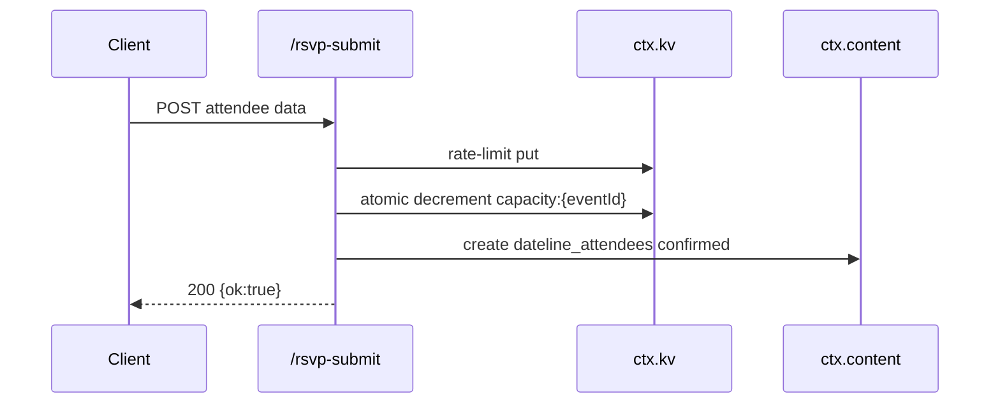
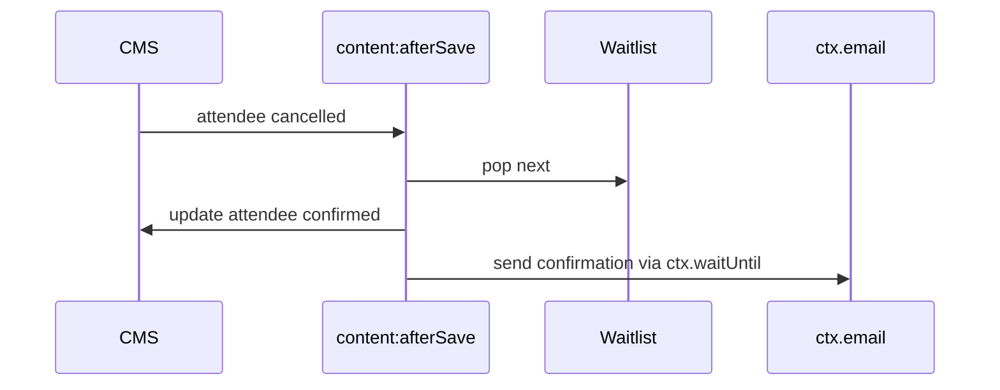

# PRO-397 RSVP Design

## Approach considered

1. **Route performs all side effects.** Simple to call but duplicates email behavior and bypasses content hooks.
2. **Route creates attendee, hook sends email / promotes waitlist.** Chosen because it keeps registration persistence separate from post-save work and matches EmDash hook semantics.

## Architecture

`routes.ts` handles request parsing, IP rate limiting, capacity decrement, and attendee creation. `hooks.ts` handles deferred emails for confirmed attendees and cancellation-triggered waitlist promotion. `waitlist.ts` encapsulates queue persistence. `capacity.ts` hides the KV atomic decrement boundary.

## Sequences

## Dependency direction

`@dateline/rsvp` depends on `@dateline/blocks` for admin responses. It writes to the core-owned `dateline_attendees` collection through `ctx.content`; it does not import `@dateline/core`.

## Module depth

The public interface is the plugin manifest plus exported route/hook functions. KV serialization, capacity fallback behavior, and Block Kit shape are hidden behind focused modules.
