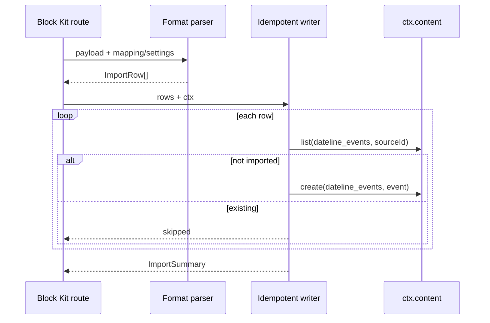

# PRO-398 Importer Design

## Approaches Considered

### Approach A — single monolithic importer route

One route detects source format, parses all rows, and writes all content inline. This is simple, but it hides parsing differences, makes per-format tests brittle, and risks exceeding the 10-subrequest budget for realistic imports.

### Approach B — small per-format parsers + shared idempotent writer

Each format exposes a pure parser returning normalized `ImportRow` values. A shared writer handles `ctx.content` boundaries, source-id checks, partial success, and error aggregation. This keeps handlers shallow and lets large imports chunk across invocations later.

**Chosen:** Approach B. It gives a deep module interface (`parse*`, `importRows`) with isolated implementation details and clearer budget accounting.

## Architecture

## Module Depth

- `ical.ts`, `csv.ts`, `json.ts`, and `tec.ts` hide format-specific parsing quirks behind pure functions.
- `importer.ts` hides content-boundary retries, idempotency checks, and per-row error collection behind `importRows`.
- `admin.ts` hides Block Kit shape construction and runs through `assertResponse()`.

## Dependency Direction

`@dateline/importer` depends on `@dateline/blocks` for Block Kit and references `@dateline/core` collection names/types. Core does not depend on importer.

## Budget

The manifest/admin handlers perform no subrequests. `importRows` uses at most two content subrequests per row (`list` then `create`) and is intended to be invoked with chunks of five rows or fewer to stay within the 10-subrequest cap.
