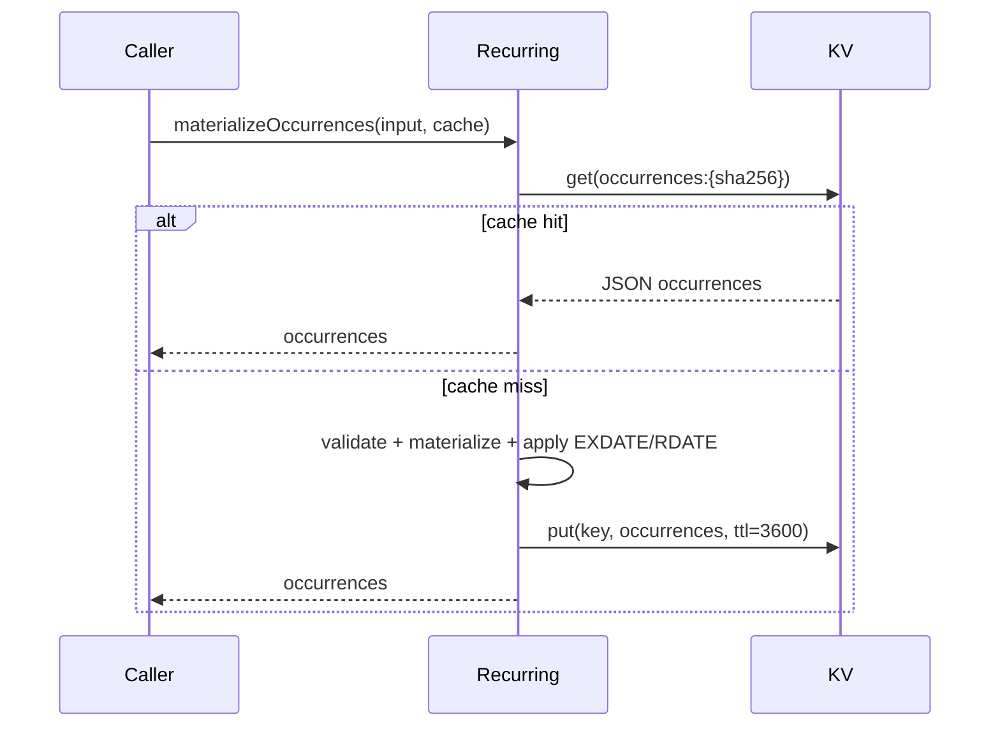

# PRO-399 Design

## Design alternatives

### Option A — eager occurrence rows

Precompute rows for every recurrence at save time. This makes reads simple but repeats the TEC failure mode: edits trigger broad rewrites and long-running work inside sandboxed hooks.

### Option B — lazy bounded materialization

Store RRULE text and compute occurrences on read for the requested range, capped to two years forward and cached by range hash. This is the chosen design because it stays within sandbox budgets, avoids migration churn, and matches the PRD.

## Module depth

The public interface is intentionally small: `validateRRule(rule, tzid)` and `materializeOccurrences(input, cache?)`. Internally the module hides RRULE parsing, floating-time correction for `rrule.js` TZID output, EXDATE/RDATE normalization, range cap enforcement, cache-key hashing, and KV read-through behavior.

## DST handling

`rrule.js` emits TZID occurrences as floating Date values whose UTC components represent local wall-clock time. The implementation converts those floating components back to real UTC instants with `Intl.DateTimeFormat` offset calculation, preserving event-local wall-clock time across DST transitions.

## Cache sequence

## Dependency direction

`@dateline/recurring` depends only on `rrule` and `zod`; downstream packages depend on its exported API. It does not depend on core, RSVP, importer, views, or blocks.

## Sandbox budget

Library-only validation and materialization perform no subrequests. When a KV cache is supplied, one `get` and one `put` occur on misses; hits use one `get`. Both paths are below the 10-subrequest cap.
