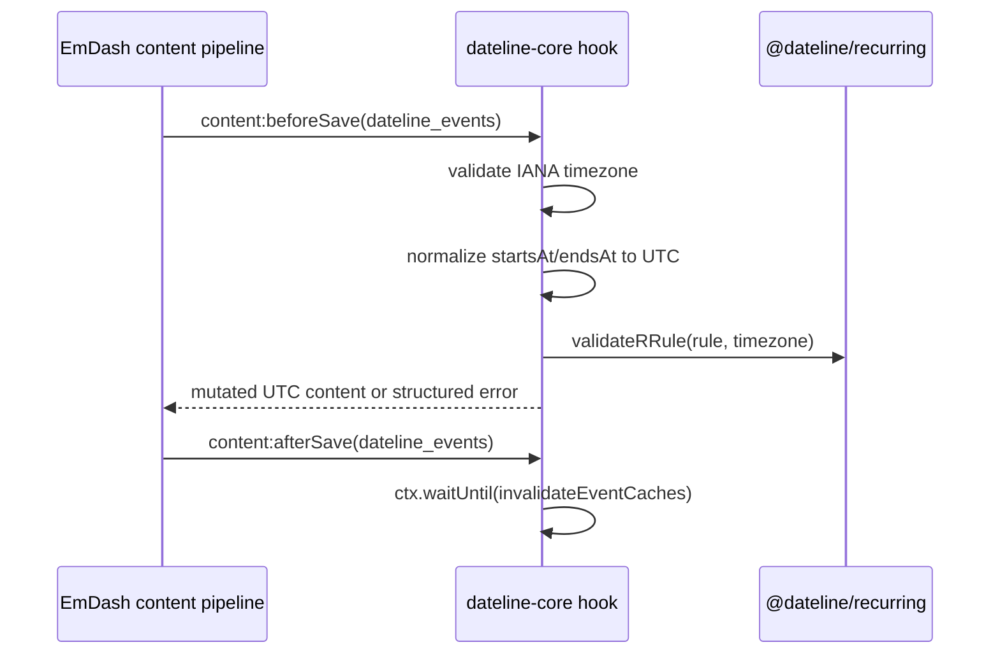
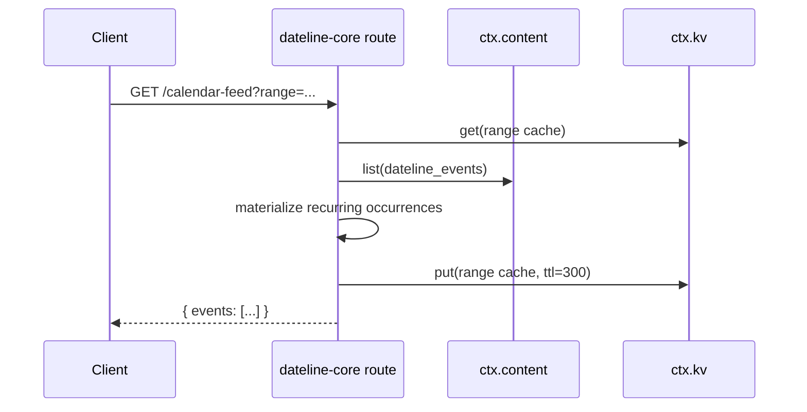

# PRO-400 Design

## Dependency Direction

`@dateline/core` depends on the completed leaf packages `@dateline/blocks` for Block Kit validation and `@dateline/recurring` for RRULE validation/materialization. Downstream packages consume core schemas; core does not import RSVP, importer, or views.

## Design Alternatives

1. **Single large plugin module:** Fast to wire but violates SRP and makes route/hook tests brittle.
2. **Focused deep modules:** Keep the public interface in `index.ts` while hiding schemas, hooks, cache, routes, iCal, GDPR, and JSON-LD details behind focused modules.

Chosen: focused deep modules. This keeps the manifest easy to inspect while each behavior has direct unit coverage.

## Hook Sequence

## Route Sequence

## Sandbox Budget

Handlers use at most three subrequests in normal paths: one content list plus optional KV get/put. Delete/privacy paths batch by rows returned and are expected to remain under the 10-subrequest cap for normal admin use; large GDPR jobs should be promoted to a future background workflow if needed.
