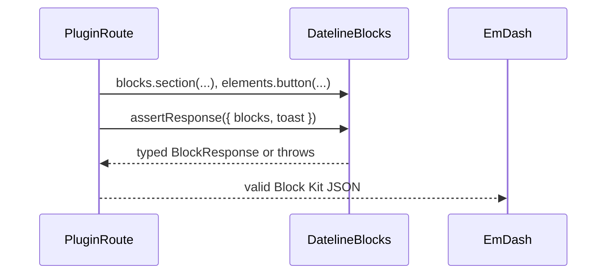

# PRO-404 Design

## Approaches considered

### Approach A — raw re-export only

Re-export `@emdash-cms/blocks` directly and rely on its validator. This is low maintenance, but it does not encode Dateline's mission contract: Stats must use `stats`, Button elements must use `text`, and plugin route responses must reject non-Block Kit transport keys.

### Approach B — Dateline facade over EmDash Block Kit

Expose Dateline builders and validation types as the public API, while keeping a namespaced raw EmDash export for compatibility. This gives downstream workers a single source of truth and a runtime invariant tuned to Dateline's gotchas.

Chosen: Approach B.

## Module depth and information hiding

The package exposes a small surface (`blocks`, `elements`, `validateBlocks`, `assertResponse`) and hides the Zod schema details. Downstream plugins do not need to know individual JSON Schema rules or gotcha-specific rejection logic.

## Dependency direction

`@dateline/blocks` depends on `zod` and optionally exposes raw `@emdash-cms/blocks` helpers under namespaced exports. All later Dateline plugins depend on `@dateline/blocks`; it does not depend on any Dateline plugin.

## Route response flow

